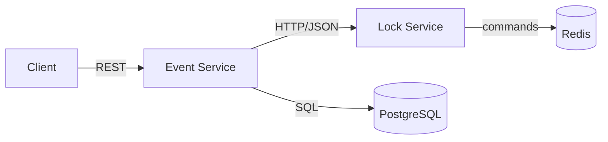
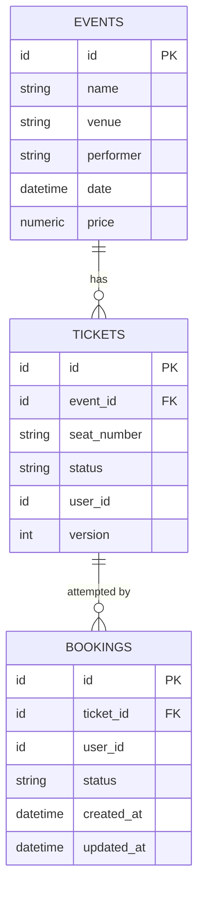
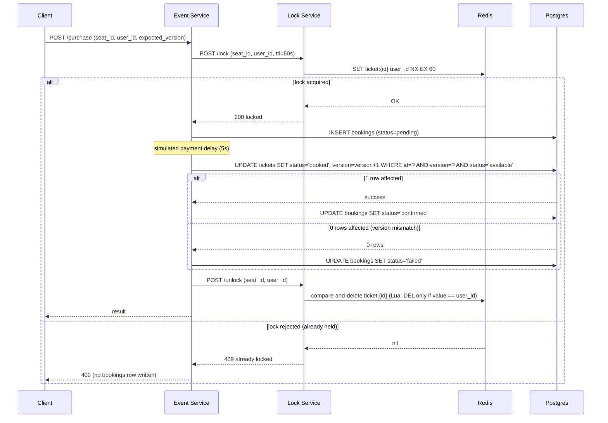

# Ticketing System — Architecture (v0)

## Overview

A distributed ticket booking system that prevents double-selling a seat under concurrent demand. Two independently deployable microservices, communicating over REST/HTTP in v0 (gRPC is a deferred, later concern).



- **Event Service** — public-facing REST API. Owns Postgres (durable state: events, tickets, bookings). Calls the Lock Service to coordinate seat locking during checkout.
- **Lock Service** — internal REST API. Owns Redis. Handles fast, short-lived seat locks with TTL expiry. No durable state.

Each service is independently deployable, has its own dependency install, and does not share code in v0.

---

## Why two layers of concurrency control

Two separate mechanisms protect against double-booking, at two different points in the request lifecycle, for two different failure modes:

| Mechanism | Where | Protects against | Why it's not enough alone |
|---|---|---|---|
| Redis TTL lock | Lock Service | Two users starting checkout on the same seat at once. Fast, cheap rejection before touching Postgres. | The lock can expire (TTL) while a checkout is still mid-flight (e.g. slow payment step), letting a second user acquire the lock before the first's write lands. |
| Postgres OCC (`version` column) | Event Service | Any write race that reaches the database, including the TTL-expiry gap above. | Doesn't stop wasted work — without the Redis lock, every concurrent request would hit Postgres and only one would win, which is slow and wasteful at scale. |

**Redis is the fast-path gate. Postgres is the correctness guarantee of last resort.** They are not redundant — v0 uses both.

TTL is sized to comfortably outlast the checkout flow: **TTL = 60s**, simulated payment delay = **5s**.

---

## Data model



### `events`
Static event info. `price` is flat per event in v0 (no per-seat/tiered pricing).

### `tickets`
Current state of each seat. Source of truth for "is this seat sold."

- `status`: `available` | `booked` — binary only. Redis is the sole source of truth for "currently locked/reserved"; that state never appears in Postgres.
- `user_id`: nullable; only non-null when `status = 'booked'`.
- `version`: OCC counter, starts at `0`, incremented on every successful purchase write. See [OCC](#optimistic-concurrency-control-occversion).
- `UNIQUE (event_id, seat_number)` — prevents duplicate seat rows for the same event at the DB level.

### `bookings`
Append-only-ish attempt log — one row per purchase attempt that reaches the payment/write stage (**not** one row per lock rejection; see below).

- `status`: `pending` → `confirmed` | `failed`.
- Multiple `bookings` rows can exist for the same `ticket_id` over time (retries after a failed attempt are expected and fine — no uniqueness constraint on `ticket_id`).
- Lock rejections (seat already locked by someone else) are **not** logged here — they're high-volume and low-signal; Redis contention is implicitly the explanation. `bookings` only reflects attempts that got as far as the OCC write stage.

---

## Optimistic Concurrency Control (`tickets.version`)

Prevents two concurrent purchases of the same seat from both committing, even if both passed the Redis lock stage (e.g. due to TTL expiry).

The purchase write is a single conditional `UPDATE`, atomic in Postgres:

```sql
UPDATE tickets
SET status = 'booked', user_id = ?, version = version + 1
WHERE id = ? AND version = ? AND status = 'available'
```

- If the row's `version` still matches what was read at checkout start, exactly one request's `UPDATE` affects 1 row — it wins.
- Any other concurrent request checking the same (now-stale) `version` affects 0 rows — it loses, and the app treats "0 rows affected" as a collision, not an error.

This must be a single atomic statement — a separate `SELECT` then `UPDATE` would reopen the same race it's meant to close.

---

## Request flow: `POST /purchase`



Key points:
- The Redis lock is released **either way** — success or OCC failure — so a failed purchase never leaves a seat stuck for the full TTL.
- `bookings` row is written only after the lock is acquired, never on lock rejection.
- Unlock is a **compare-and-delete**, not a plain `DEL`: if this lock's TTL already expired and a different user has since acquired it, a stale `/unlock` call from the original request must not delete the new holder's active lock. The Lua script only deletes the key if its value still matches the caller's `user_id`; otherwise it's a no-op. This doesn't change the double-sell guarantee (Postgres OCC already provides that) — it only prevents a late unlock from prematurely evicting someone else's in-flight lock.

---

## Request flow: `GET /seats`

v0 reads Postgres only — no Redis merge yet (that's deferred to v1). Response reflects durable `tickets.status`, not live lock state.

---

## v0 scope boundaries

**In scope:**
- Two services, REST/HTTP between them.
- Single-seat locking (`SET NX EX` to acquire).
- Compare-and-delete on unlock (small Lua script — only deletes the lock if its value still matches the caller's `user_id`; see below).
- Postgres OCC on `tickets.version`.
- `bookings` as a pending/confirmed/failed attempt log.
- Docker Compose for local Postgres + Redis.

**Explicitly deferred (v1+):**
- Redis merged into `GET /seats` for real-time seat availability.
- Multi-seat all-or-nothing Lua locking script (compare-and-delete on unlock is the only Lua in v0; multi-seat locking is still deferred).
- gRPC replacing HTTP/JSON between services.
- Full fencing tokens (compare-and-delete on unlock closes the "stale unlock deletes someone else's lock" race, but a monotonic fencing token is a more general mechanism still deferred to v1).
- Load testing (k6/Locust) for the thundering-herd scenario.

---

## Tech stack

- **Language:** Python + FastAPI (both services).
- **Lock Service:** Redis (`redis-py`, async).
- **Event Service:** PostgreSQL (async driver, TBD at implementation time — `asyncpg` or async SQLAlchemy).
- **Service contract:** each service's own FastAPI-generated OpenAPI schema; no hand-written spec, no shared code package in v0.
- **Local infra:** Docker Compose (Postgres + Redis containers).
